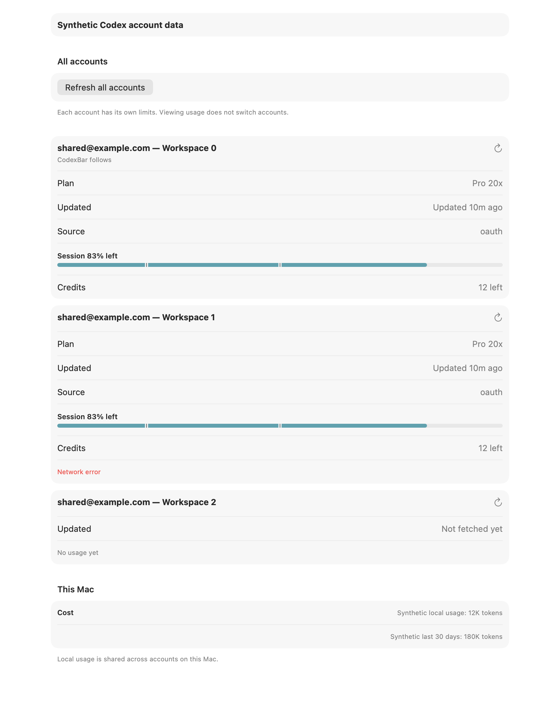
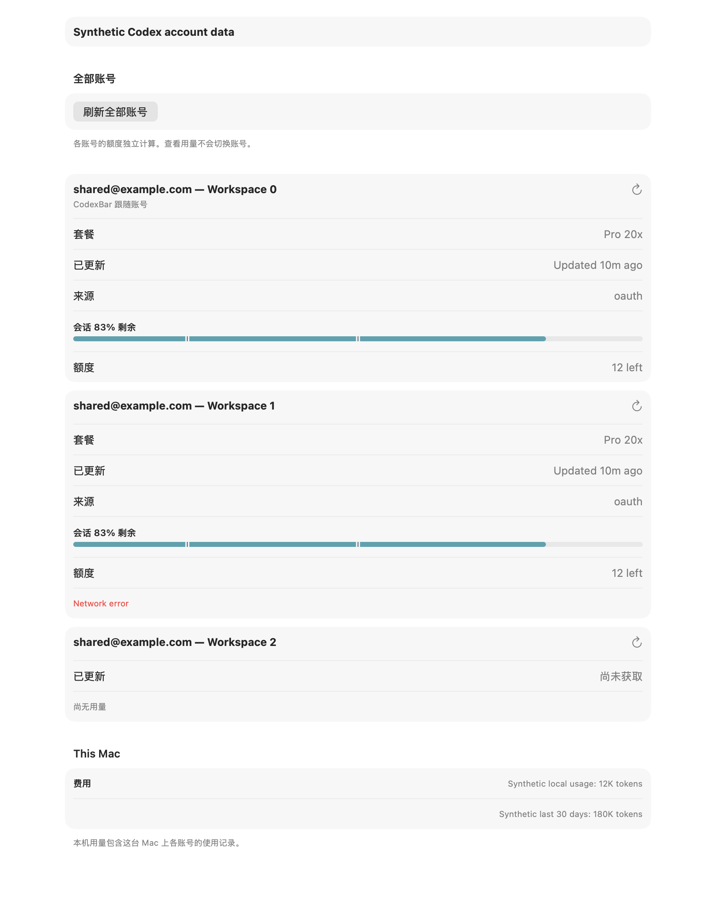

# Codex account overview proof

All identities, credentials, quota values, credits and local token counts in this proof are synthetic. The fixtures do not copy any real account or usage history.

The opt-in test renders the production `ProviderAccountUsageOverviewView` and local cost rows through `NSHostingView`, without launching the app or displaying a window. It covers a cached followed account, a failed sibling retaining its original usage age, an account without usage, shared local usage shown once, and private labels at a narrower width. Rendering proves the native layout, not mouse interaction or a live account refresh.

```sh
source Scripts/test_environment.sh
CODEXBAR_ACCOUNT_OVERVIEW_PROOF_DIR=/tmp/codex-account-overview-proof \
  swift test --filter 'render synthetic multi account settings overview'
```

The companion refresh tests use synthetic managed OAuth homes, stubbed provider/reset-credit transports, in-memory settings and a temporary file-backed snapshot store. They verify single-account refresh without changing the followed usage, selection or credential files; all-account refresh in bounded batches beyond the six-account menu limit; failure retention; privacy; stale-result rejection after selection changes; PAT exclusion; and verified error ownership.






