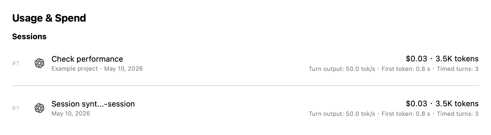
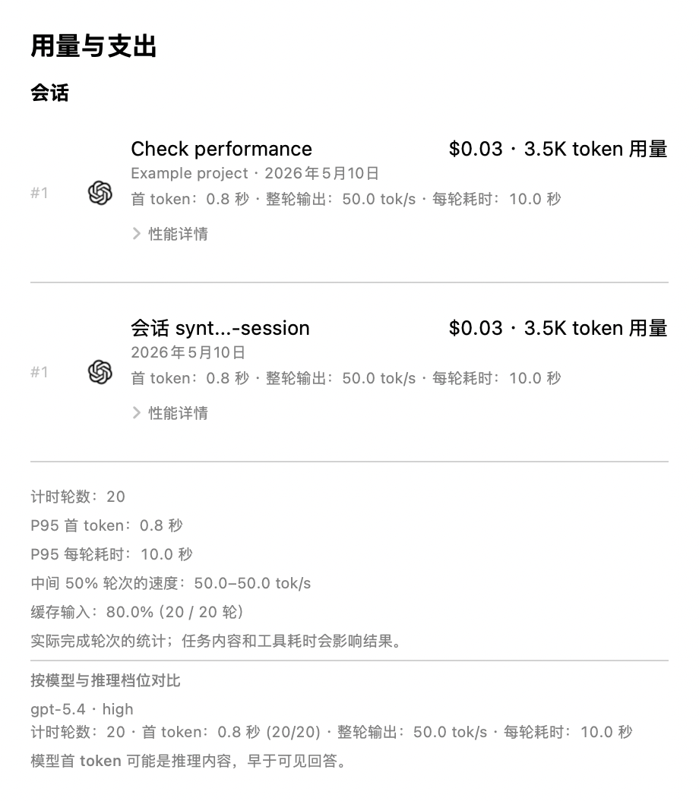

# Spend session turn performance validation

Validated on arm64 macOS 27 with Swift 6.4. Upstream baseline:
`ab32496d3c1f861981aa1a19aee2f933204f9bb9`. Feature production code:
`22fdcb88e8d77a03c9d8447f889012247d4bb483`.
The original validation used parser revision 9. The advanced details use parser revision 10; the current generated parser hash is checked by `make check`.

## Metric contract

Native Codex session rows show total valid output tokens divided by total valid
turn duration, median available first-token latency, and median completed-turn
duration. The number of timed turns remains in the tooltip and expanded details. Output includes reasoning tokens already contained in output. Duration
includes tools, retries, network and waiting; this is whole-turn throughput.
Session summaries can combine models and tool-heavy turns and are not a model
streaming benchmark. Samples belong to their completion day.

Only successful completed turns with deduplicated authoritative request usage
matching the reported turn total are counted. Invalid owned usage or completion
timestamps invalidate timing; missing first-token timing only removes that
latency observation. Billing behavior is unchanged. Compatible predecessor
ledger rows and saved pricing survive bounded timing backfill, including the
current upstream parser hash. Upstream's retained-report pricing migration still
clears the affected older report payload while keeping the ledger/checkpoints.

## Advanced details

Each native Codex session has a collapsed **Performance details** disclosure.
Details retain the selected completion-day range and include:

- P95 model-first-token and completed-turn duration using nearest-rank percentiles.
  Each metric needs at least 20 valid observations of its own; missing TTFT does
  not reduce the duration sample count. Twenty is a display threshold, not a
  statistical confidence guarantee.
- The middle 50% of per-turn output rates (nearest-rank P25–P75), after at least
  four completed turns. Different tasks and tool use can explain this spread.
- Cached-input tokens divided by total input tokens in eligible completed turns,
  with the cache sample coverage. Native Codex input already includes cached input;
  ratios are input-weighted, not averages of request percentages. Zero input and
  overflowing or invalid counters do not produce a ratio.
- Model and reasoning-effort groups, with timed-turn and available-TTFT counts,
  weighted whole-turn throughput and median latencies. Missing/mixed attribution
  remains unknown; these observations do not rank model capabilities.

Effort comes from the owning `turn_context.payload.effort`, joined by turn ID.
It is never inherited from another turn. Conflicting or cleared effort within
one turn is unavailable. A turn using multiple response models is unattributed.
Model-first-token may be reasoning and does not establish first visible answer
latency. Claude and OpenCodex rows remain without timing when their source does
not provide the validated native completion/usage contract.

Parser revision 10 uses existing bounded migration and retained-pricing logic.
Revision 8 and 9 cache fixtures verify that authoritative ledger rows survive
backfill. No new background poll, account probe or external dependency is added.

## UI evidence and runtime boundary

These images render the production session component with **synthetic inputs**,
including normal and hidden-personal-info variants. English and Simplified
Chinese, light and dark appearances, and 820- and 420-point widths were checked.



[Narrow synthetic session rows](screenshots/spend-turn-performance-synthetic-narrow.png)

A fresh release bundle was produced by `Scripts/package_app.sh release` with
ad-hoc signing and passed its resource and six-second launch smoke checks.
The follow-up application copy uses a separate bundle identity, isolated home,
configuration and app-group team, disabled Keychain/cookie access, and a failing
provider CLI stub. No credentials or account configuration were copied.

**Installed-window behavior and sustained interactive operation remain pending.**
An earlier computer-use attempt reported a locked Mac and requested manual unlock; no
native-window/date-picker/responsiveness success is claimed. Component images,
packaging smoke checks and production fetcher receipts do not establish that
behavior. A private reference expects 36 timed turns for today and 41 for the
last seven days, ready for the actual window check once desktop access works.

## Follow-up date-filter review

A follow-up review reproduced a completion-day omission on the previously
validated feature: a turn starting at 23:59:55 and completing ten seconds later
had a valid timing sample, but its session row was discarded because all billed
requests belonged to the previous day. Session projection now retains valid
completion-day samples even when that day has no billing rows. Billing remains
on the original request day; no tokens or cost are moved into the completion day.

The dashboard also retains native Codex timing samples in the selected range
when the session file was modified outside that range. This exception does not
apply to other providers or OpenCodex sessions. Both cases have regression tests.
The follow-up parser hash is `d35c9fb00bee059b`; the historical receipts below
remain evidence for the earlier feature revision, not this follow-up.

Follow-up validation passed: 20 focused tests in three suites, and `make check`
with 2,819 Swift files and zero violations. The initial serial `make test` stopped
after 108 successful groups at a source-architecture check: moving the Codex-only
condition had left its required explanatory comment at the old location. The
comment was moved alongside the condition; no assertion was relaxed.

A complete fresh `./Scripts/test.sh --direct-workers 4` then passed all 143 groups
and all 1,571 discovered selections on their first attempt, with zero failures,
timeouts or retries (370.6 seconds total). This is the repository's supported
four-worker direct runtime, which verified 13,861 test methods against discovery;
it is distinct from the earlier serial invocation.

The existing English/Chinese, light/dark and narrow-width component renders were
visually reviewed again. Native application selection repeatedly timed out in
the desktop tool, while Finder remained accessible. Process startup and an idle
main-thread sample do not establish window interaction or responsiveness; that
proof gate remains open. No new installed-window success is claimed.

## Release benchmark

Both production Core targets were independently built in release mode (`-O`).
`-enable-testing` allows the standalone adapter to access internal scanner
counters; it does not enable DEBUG code. The adapter is identical for both
builds, with `TURN_PERF_FEATURE` selecting only the optional sample assertion.
The scanner, cache and projection are production implementations.

The smaller corpus has 24 files / 960 turns / 3,840 requests; the larger has
96 files / 7,680 turns / 46,080 requests. Each has three trials, each with one
cold read, three unchanged refreshes and one single-file append. These are
medians. Reload includes SQLite decoding and session projection, not UI startup.

| Corpus | Path | Baseline | Feature | Change |
| --- | --- | ---: | ---: | ---: |
| Smaller | Cold scan | 194.0 ms | 197.0 ms | +1.5% |
| Smaller | Unchanged refresh | 59.5 ms | 57.1 ms | -4.0% |
| Smaller | Single-file append | 31.9 ms | 29.7 ms | -6.7% |
| Smaller | Cache reload / session projection | 47.8 ms | 48.6 ms | +1.5% |
| Larger | Cold scan | 2,009.1 ms | 2,099.9 ms | +4.5% |
| Larger | Unchanged refresh | 633.9 ms | 633.6 ms | -0.1% |
| Larger | Single-file append | 291.1 ms | 278.4 ms | -4.4% |
| Larger | Cache reload / session projection | 542.8 ms | 556.7 ms | +2.6% |

A second complete comparison after the full suite ended reversed the binary
order (feature, then baseline). It produced the following medians:

| Corpus | Path | Baseline | Feature | Change |
| --- | --- | ---: | ---: | ---: |
| Smaller | Cold scan | 201.1 ms | 190.4 ms | -5.3% |
| Smaller | Unchanged refresh | 55.8 ms | 55.9 ms | +0.2% |
| Smaller | Single-file append | 29.3 ms | 28.5 ms | -2.6% |
| Larger | Cold scan | 1,958.2 ms | 2,200.7 ms | +12.4% |
| Larger | Unchanged refresh | 610.9 ms | 621.1 ms | +1.7% |
| Larger | Single-file append | 277.7 ms | 274.8 ms | -1.1% |

The larger cold overhead was 4.5% in the first comparison and 12.4% in the
repeat, so the first figure alone is insufficient. Warm refresh overhead was
between -0.1% and +1.7%; cache/session projection retained a few-percent overhead.
The lower smaller-corpus timings are measurement variation, not a claimed
speedup. Both complete result sets are retained in the raw proof.

Cold cache and side files grew by 6.5% / 4.5% (4.32 to 4.60 MiB / 49.54 to
51.80 MiB). All unchanged refreshes processed zero usage rows; append processed
only the 4 / 6 new requests. Every feature run matched expected timing counts,
including the one appended turn.

The complete benchmark process peaked at 1.21 / 1.23 GiB RSS, a 1.7% increase.
This includes fixture construction, all trials, scanning and cache projection;
**it is not an application memory or leak measurement**. Repository tests and
other host work were active, so small changes are noisy observations. The
larger cached projection still takes roughly half a second; these finite
measurements are not a release performance guarantee.

[Raw synthetic results and build metadata](proofs/spend-turn-performance-release.json)
and [standalone adapter](proofs/spend-turn-performance-release-probe.swift.txt)
are public and contain no real usage data.

## Native-history validation

Production fresh and reopened-cache reads matched an independent reference for
41 valid turns in six privately copied native files (75,187,821 bytes). Full
usage-counter validation excluded two output-only candidates, including owned
records with reasoning greater than output. The source histories were left
untouched. No credentials, identities, actual token counts, monetary values or
real throughput/latency values are published.

[Redacted receipt](proofs/spend-turn-performance-native.json) and the
[independent offline join](proofs/spend-turn-performance-native-reference.py)
are available. The reference is intentionally limited to this dependency-closed
root-session corpus; adversarial/fork/partial-scan behavior is covered by Swift
tests. Private reference output must stay private.

## Regression validation

- `make check` passed: 2,818 Swift files, zero lint violations.
- 123 focused tests in seven suites passed after the upstream rebase, including
  numeric/timestamp rejection, duplicate ownership, partial/completion-only
  append, bounded revision-8 backfill, pricing migration and cache reopening.
- The opt-in native-history proof passed separately with its input supplied;
  ordinary full-suite execution intentionally skips its private-input branch.
- `make test` passed in one complete invocation: all 143 groups / 1,570
  discovered selections passed on their first attempt, with zero failures,
  timeouts or retries (1,221 seconds total). This uses the repository default
  serial runner and unmodified assertions; earlier interrupted preparation
  runs are not counted as complete passes.

English, Simplified/Traditional Chinese and Italian captions are translated;
other catalogs currently use English fallback. Completely missing or
unrecognizable log records cannot establish sample completeness from the
available protocol. App-level interaction and sustained responsiveness still
require native-window verification.

## Reproduction

Use two clean worktrees at the baseline and feature commits. Copy the linked
adapter to `ProofTarget/main.swift` in each, and temporarily append these
SwiftPM manifest entries:

```swift
package.products.append(.executable(name: "TokenSpeedReleaseProbe", targets: ["TokenSpeedReleaseProbe"]))
package.targets.append(.executableTarget(name: "TokenSpeedReleaseProbe", dependencies: ["CodexBarCore"], path: "ProofTarget"))
```

Build each independently using `swift build -c release --product
TokenSpeedReleaseProbe -j 2 -Xswiftc -enable-testing`; add `-Xswiftc
-DTURN_PERF_FEATURE` for the feature adapter. Set
`CODEXBAR_PERFORMANCE_BENCHMARK_OUTPUT` when running the produced binary.
No test-only flag changes the scanner execution path. Restore the temporary
manifest afterward, and never copy build products between worktrees.

The existing opt-in Swift test benchmark uses the same fixture through
`CostUsageTurnPerformanceBenchmarkTests`. Optional component rendering uses
`CODEXBAR_PERFORMANCE_UI_PROOF_DIR` and `CODEXBAR_PERFORMANCE_UI_PROOF_WIDTH`
with `SpendSessionPerformanceTests`. The native-history proof requires a private
directory with `sessions/` and independently prepared `expected.json`, supplied
through `CODEXBAR_PERFORMANCE_NATIVE_PROOF_DIR`.

## Advanced-details validation (2026-10-07)

The advanced-details receipt is separate from earlier release comparisons:
[redacted receipt](proofs/spend-turn-performance-details.json). Twenty-eight
focused tests in four suites passed, including plain and escaped JSON keys/values,
Foundation fallback, conflicting/missing effort, native-only completion-date
filtering, percentile thresholds, input-weighted cache ratios and revision 8/9
backfill preserving authoritative ledger rows. The production fetcher and reopened
cache matched the independent extended reference for 41 turns in six copied native
files; no real usage values or identities are published.

Current static checks passed (`make check`, 2,821 Swift files, zero violations).
The complete supported `./Scripts/test.sh --direct-workers 4` invocation exited
successfully: all 143 groups / 1,572 selections passed, with 141 groups passing
first attempt and two recovering on the runner's fresh-process retry (618.4 s;
zero group timeouts). The initial issues were an unrelated WebKit fixture wait
in `OpenAISubscriptionMetadataTests` and a generic weekly-history persistence
expectation in `UsageStorePlanUtilizationTests`. No assertions were changed or
failures suppressed. This is a retry-assisted pass, not a clean first-pass run.
Advanced-detail strings are translated in English, Simplified Chinese and Italian;
the other synchronized catalogs currently use English fallback for those strings.

The synthetic debug benchmark ran three trials each for 24 sessions / 960 turns
and 96 sessions / 7,680 turns. Advanced summary construction medians were 1.7 ms
and 13.1 ms respectively; the larger maximum was 30.5 ms. Every unchanged refresh
reprocessed zero usage rows. These are absolute timings on a shared host, not a
release comparison, app responsiveness measurement or memory-leak proof.



The screenshot is a production-component render with synthetic values, not an
installed-window screenshot. Desktop app selection timed out, so this revision
still has no verified installed-window expand/collapse or sustained responsiveness
proof. Do not substitute startup/signature checks for that interaction gate.
